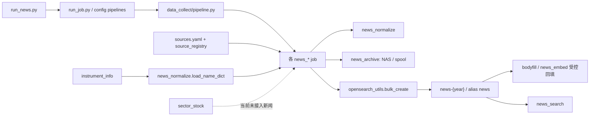

# 新闻系统第一阶段开发实施方案

> 基线：`NEWS_ENGINE_AUDIT.md`、已冻结的 `NEWS_DATA_MODEL_V1_1.md` 与当前项目静态代码。  
> 本文只制定方案；本次工作不修改 Python、配置或 SQL，不安装依赖，不运行爬虫，不连接数据库，不创建或修改 OpenSearch 索引。

## 0. 阶段结论与边界

第一阶段应采用“旧链路不动、契约先行、增量双写、读取双读、派生数据分离”的路线，而不是另起一套新闻采集系统。

核心决策如下：

1. **现在不建立 `news-documents-v1`。** 第一阶段继续使用现有 `news-{year}` 和别名 `news`；先把它扩展成 V1.1 的兼容文档投影。否则会立刻引入双索引写入、重放一致性、向量双回填和搜索切换四类新问题。
2. **现有字段不改名，只增加规范字段。** 新文档同时写 `pub_time/publish_time`、`fetch_time/collect_time`、`source/source_id`、`stocks/stock_codes`；历史文档由兼容读取层回退，不在第一阶段强制回填。
3. **现有 `_id`、原始归档和 create-only 机制继续作为证据层底座。** `_id` 原样投影为 `news_id`，不重新生成 ID；NAS gzip JSONL 归档继续保留原始信封。
4. **`stocks[]` 继续是现有搜索的兼容过滤字段。** `stock_codes` 第一阶段只镜像 `stocks`，不得用新的实体匹配结果覆盖、扩充或缩减 `stocks`。
5. **Source、SourceHealth、Entity、EntityAlias 与新闻原文分开治理。** 来源健康变化不修改 Source revision；实体/别名重算也不直接更新历史新闻原文。
6. **第一阶段不宣称完成全量 V1.1。** 对尚无可靠来源的字段保持缺失或显式 unknown，绝不为满足“必填”而伪造权威分、公司全称、别名有效期、首发、重复类型或实体关系。

本阶段明确不做：Event、EventDocumentMembership、事件聚类、首发识别、S/A/B/C、Importance、Sentiment、Impact、完整 StockRelation/IndustryRelation、产业链、海外到 A 股映射、UI、新增新闻源。`title_hash/content_hash` 可以作为纯确定性签名准备，但不得据此生成事件或宣称已完成语义去重。

## 一、现有代码映射

### 1.1 当前真实链路



### 1.2 十五项逐项映射与处置

| 项目 | 当前负责文件 | 当前事实 | 第一阶段处置 | 原因 |
|---|---|---|---|---|
| 1. 新闻采集 | `data_collect/jobs/news_flash.py`、`news_policy.py`、`news_regulator.py`、`news_cctv.py`、`news_announcement.py`、`news_stock.py`、`news_us.py`；底层还有 `source_adapters.py`、`cninfo.py` | API/AkShare、RSS/RSSHub、列表页、公告 API 已按 job 隔离；多数 job 已有单源失败隔离 | **直接保留采集实现；仅在后续小步骤接入统一投影和健康观测** | 采集覆盖和容错已可用，第一阶段无理由重写适配器 |
| 2. 新闻规范化 | `data_collect/utils/news_normalize.py`，以及各 job 的 `_row_to_envelope`、`_entry_to_envelope` 等 | 公共层负责文本、时间、ID、代码标准化；不同载荷仍由 job 组装旧信封 | **保留公共函数，新增 V1.1 兼容适配层，不把所有来源重写成一套 parser** | 来源差异属于采集层；规范字段可在统一出口补齐 |
| 3. 新闻 ID | `news_normalize.make_id()`；OpenSearch `_id` | 优先 `source + native_id`，其次 URL SHA1，最后 `source/pub_time/title/content` SHA1；create-only 按 `_id` 幂等 | **原样保留；`news_id = _id`** | 改 ID 会破坏归档重放、历史去重和跨年幂等 |
| 4. `publish/pub_time` | `news_normalize.normalize_time()` 和各 job 的信封构造 | 当前统一为北京时间无时区字符串；缺失时多回退 `fetch_time`，部分信封保留 `time_estimated` | **保留 `pub_time`；新增 `publish_time` 镜像和读取回退；精度未知时写 `unknown`** | 不改变当前路由和搜索日期过滤；不从格式化后的秒值伪造来源精度 |
| 5. `fetch_time` | `news_common.now()`/各 job 运行时生成 | 表示本轮取得文档的时间，也是向量和全文队列排序字段 | **保留 `fetch_time`；新增 `collect_time` 镜像** | 现有回填和日报依赖 `fetch_time`，不能直接改名 |
| 6. `stocks[]` | `news_normalize.tag_stocks()`、`normalize_stock_code()`；公告和个股 job 有权威/查询代码补充 | 正则代码 + 简称子串；公告用 `secCode`；个股新闻合并查询股票和文本命中 | **直接保留；`stock_codes` 仅镜像；实体匹配先 shadow，不回写** | 当前搜索按 `stocks` 精确过滤，误覆盖会直接破坏候选股召回 |
| 7. `instrument_info` | `data_collect/jobs/a_share_instrument.py`；`news_normalize.load_name_dict/load_a_share_codes` | xtquant 当前快照，除每日变动字段外动态建列；稳定消费只有 `stock_code`、`InstrumentName` | **保留采集表；新增只读 Entity/EntityAlias 适配器** | 表结构不是固定 83 列契约，不能把可选字段当必有字段 |
| 8. `sector_stock` | `data_collect/jobs/a_share_sector.py`、`sql/005_create_sector.sql` | 只有 `sector_name/stock_code/update_date`；体系和层级编码在 `GICS1..4/THY1..3/TDGN/TGN/TFG` 前缀中 | **保留为只读兼容输入；第一阶段只提供内存 crosswalk，不生成 IndustryRelation** | 缺少稳定 sector ID、独立体系/层级/类型列，不能直接升级为行业权威主数据 |
| 9. OpenSearch mapping | `data_collect/utils/opensearch_utils.py::_INDEX_BODY_TEMPLATE/_render_index_body/ensure_index` | 新年份建 `news-{year}`；已存在索引只捕获“已存在”，不会自动 PUT mapping | **保留原模板逻辑，新增集中 schema/diff 模块并做 additive mapping** | 仅改模板不会更新历史年份；必须显式区分“未来新索引模板”和“已有索引迁移” |
| 10. OpenSearch 写入 | `opensearch_utils._build_actions/bulk_create/bulk_update`，各 news job 调用 | 原文 create-only；全文和向量使用显式物理 `_index/_id` 局部 update | **保留 create-only；在 create 前对副本增加兼容字段；新增 enrichment 更新白名单** | 不能让重新采集把 `done` 或向量打回 pending，也不能修改归档中的原始信封 |
| 11. 全文回填 | `news_fulltext.py`、`news_announce_pdf.py`、`utils/bodyfill.py`、`fulltext.py`、`pdftext.py` | 扫 pending 快照，按显式 `_index/_id` 回填 `body` 和状态；失败不拖垮整批 | **直接保留；只补正式 mapping、版本/更新时间与更新白名单** | 现有幂等状态机和显式物理索引写入是正确基础 |
| 12. 向量回填 | `data_collect/jobs/news_embed.py`、`utils/embedding.py` | 扫 `vec_status=pending`，写 `content_vec + done`；索引 `_meta` 有模型名，但文档没有版本 | **保留流程；同一原子 update 增加 `embedding_model_version`** | V1.1 要求逐文档知道向量版本；不能只依赖索引级 `_meta` |
| 13. 新闻搜索 | `data_collect/utils/news_search.py` | BM25/kNN/hybrid/RRF；按旧 `pub_time/stocks/channel` 过滤，返回旧 `source/pub_time` | **第一阶段不改查询契约；用双写保证它继续工作** | 搜索是现有外部行为，先保持回归基线；新消费者走独立双读 helper |
| 14. source registry | 根目录 `sources.yaml`、`source_registry.py`、`source_adapters.py`、`manage_sources.py`；快讯与 `em_cjzc` 在 job 内 | YAML 注册 47 个；`cls/em/sina/em_cjzc` 在注册表外；运行时 `Source` dataclass 只是采集配置 | **直接保留运行注册表；新增领域 Source catalog 适配，不重命名旧类** | 避免把“采集配置 Source”和“V1.1 治理 Source”混为同一 Python 对象 |
| 15. 调度和健康监控 | `run_news.py`、`run_job.py`、`pipeline.py`、`config.example.yaml`、各 job 的 `run_verify`、`news_report.py`、`notify.py`；快讯 `.flash_source_state.json` | APScheduler、任务超时/重试、TaskResult、钉钉、归档 verify、日报和快讯断流均已存在；但大多是任务级或人类可读摘要 | **保留调度/告警；在单源边界新增结构化观测，复用现有结果和重试，不解析摘要字符串** | `news_policy/news_us/news_regulator` 一项任务含多源，单靠 pipeline 成败无法得到 SourceHealth |

### 1.3 不应被误判为可直接复用的能力

- `title.raw` collapse 和确定性 `_id` 是精确幂等，不是事件聚类。
- `stocks[]` 是粗过滤提示，不是 StockRelation，也没有相关度或理由。
- `sector_stock` 是股票—板块当前快照，不是新闻—行业关系。
- `news_report.py` 统计频道与向量积压，不是来源级健康数据库。
- `instrument_changelog` 只能记录项目首次运行后的字段变化，不能回溯完整证券曾用名历史。

## 二、第一阶段建议新增文件

当前项目已经采用 `data_collect/jobs` + `data_collect/utils` 的扁平结构。本阶段只新增一个小型 `news_model` 包，不拆成 `enrichment/source_health/entity` 三套空目录。

```text
ashares_data_collect/
  source_governance.yaml
  manage_news_foundation.py
  data_collect/
    news_model/
      __init__.py
      contracts.py
      compat.py
      source_catalog.py
      entity_catalog.py
      source_health.py
      opensearch_schema.py
  sql/
    012_create_news_entity_foundation.sql
  tests/
    test_news_model_contracts.py
    test_news_model_compat.py
    test_news_source_catalog.py
    test_news_entity_catalog.py
    test_news_source_health.py
    test_news_opensearch_schema.py
```

### 2.1 新文件职责

| 文件 | 职责 | 输入 | 输出 | PostgreSQL | OpenSearch | 是否修改现有新闻文档 |
|---|---|---|---|---:|---:|---:|
| `data_collect/news_model/contracts.py` | 定义 Phase 1 的 `NewsDocument/Source/SourceHealth/Entity/EntityAlias` 记录类型、枚举和条件校验；Python 类使用 `SourceRecord`，避免与旧 registry `Source` 冲突 | 普通 dict/标量 | 经校验的记录或明确错误 | 否 | 否 | 否 |
| `data_collect/news_model/compat.py` | 旧/新字段双读；从旧信封生成不改入参的 V1.1 兼容投影；检测成对字段冲突 | 旧 OpenSearch `_source` 或新信封、可选 SourceRecord | canonical view、待创建的兼容副本、冲突诊断 | 否 | 否 | 只生成副本，不直接写 |
| `data_collect/news_model/source_catalog.py` | 合并 `sources.yaml`、快讯 mini-registry、`em_cjzc` 与治理覆盖；保证生产 source_id 全部可解析 | `sources.yaml`、`source_governance.yaml`、当前 config/job 常量 | `dict[source_id, SourceRecord]`、缺失/冲突报告 | 否 | 可选投影 | 否 |
| `source_governance.yaml` | 只保存来源名称、类别、原创/聚合属性、地区语言、时区、官方性、许可、付费墙、权威状态/版本等低频治理字段 | 人工审定配置 | Source 静态覆盖 | 否 | 否 | 否 |
| `data_collect/news_model/entity_catalog.py` | 只读 `instrument_info/instrument_changelog/sector_stock`，生成证券 Entity、EntityAlias 和只读 sector crosswalk；对动态列做显式白名单探测 | PostgreSQL 快照/变更记录 | Entity/EntityAlias 记录与诊断 | **读；同步时写新主数据表** | 可选投影 | 否 |
| `sql/012_create_news_entity_foundation.sql` | 在真正实施且获准后创建 Entity/EntityAlias revision 表及必要唯一约束；不改旧 `instrument_info/sector_stock` | 冻结模型 | PostgreSQL DDL | **是** | 否 | 否 |
| `data_collect/news_model/source_health.py` | 定义结构化 source observation、聚合为 SourceHealth、当前态/历史态 sink；sink 必须 fail-open 并可本地暂存 | job 单源结果、pipeline 重试/超时、verify 结果 | SourceHealth current/history 文档 | 否 | **是** | 否 |
| `data_collect/news_model/opensearch_schema.py` | 集中定义 additive 字段、独立索引 mapping、现有 mapping diff 和只允许兼容变更的校验 | 目标 schema、当前 `_mapping` | dry-run diff/管理员可执行计划 | 否 | **读；获准后写 mapping/index** | 只扩 mapping，不写历史 `_source` |
| `manage_news_foundation.py` | 与现有 `manage_sources.py` 风格一致，提供 `validate-sources`、`inspect-entities`、`mapping-diff`、`sync-* --dry-run` 等运维入口；不含爬虫 | 配置、PG、OS | 报告或经明确参数触发的同步 | 视子命令 | 视子命令 | 默认否；不提供原文覆盖命令 |

`__init__.py` 只暴露稳定接口，不放业务逻辑。测试文件与对应模块一一配套，不再另建抽象 repository/service 层。

### 2.2 后续需要小改、但不应重写的现有文件

| 文件 | 计划中的最小改动 |
|---|---|
| `data_collect/utils/opensearch_utils.py` | 从新 schema 模块合并 future-index mapping；`bulk_create` 对文档副本应用兼容投影；保留原路由和 create-only |
| `data_collect/utils/news_archive.py` | 可新增不破坏原 `append()->int` 的 archive receipt 接口，用 `news_id` 定位 NAS/spool 记录；旧调用保持不变 |
| `data_collect/jobs/news_embed.py` | 向量与 `embedding_model_version` 同一 update 写入 |
| `data_collect/utils/bodyfill.py` | 使用 enrichment 字段白名单，补 `updated_at`；不改正文抽取算法 |
| 各 `news_*.py` 采集 job | 分批接入 source observation；如需精确 `raw_archive_uri`，再逐 job 使用 receipt 接口；每次只改一个 job |
| `data_collect/pipeline.py` | 为既有 task attempt/timeout/retry 产生任务级结构化事件；不从 TaskResult 猜测多源细节 |
| `run_news.py`、`run_job.py`、`news_search.py` | 初期不改；SourceHealth shadow 稳定后才考虑增加独立同步任务，且不改变现有 pipeline 顺序 |

## 三、兼容迁移方案

### 3.1 读写规则

迁移期统一读取优先级：

| 规范语义 | 优先读 | 回退读 | 发现两者不一致时 |
|---|---|---|---|
| 新闻 ID | `_source.news_id` | hit `_id` / 信封 `_id` | 记录一致性错误，禁止自动换 ID |
| 发布时间 | `publish_time` | `pub_time` | 返回新字段，同时记录 mismatch 指标，不修改原文 |
| 采集时间 | `collect_time` | `fetch_time` | 同上 |
| 来源 | `source_id` | `source` | 同上；必须验证可解析到 Source |
| 股票过滤 | `stock_codes` | `stocks` | 同上；Phase 1 禁止自动求并集后覆盖任一字段 |

新写入必须继续带旧字段。`index_name_for()` 第一阶段仍按 `pub_time`、缺失时 `fetch_time` 路由，避免跨年路由发生行为变化。

### 3.2 第一阶段直接写入现有 `news-{year}` 的字段

只对**新采集并首次 create 的文档**写兼容字段；历史文档不做强制回填。

| 类型 | 字段 | 规则 |
|---|---|---|
| 原样保留 | 当前全部已映射字段 | `title/content/summary/body/pub_time/fetch_time/source/channel/url/stocks/vec_status/ann_type/pdf_status/body_status/content_vec` 不改语义 |
| 身份/版本 | `news_id`、`schema_version` | `news_id` 必须等于 `_id`；schema 指向冻结的 NewsDocument 契约 |
| 时间兼容 | `publish_time`、`collect_time`、`publish_time_precision`、`publish_time_is_estimated` | 前两者镜像旧字段；精度无证据时 `unknown`；估算标记由现有 `time_estimated` 投影 |
| 来源兼容 | `source_id`、`source_authority_status`、可空 `source_authority`、`source_authority_version` | 从 Source 快照取得；`unrated` 必须无分数，禁止写 0 |
| 文档静态属性 | `document_type`、`language`、`country_region_codes`、`content_license`、`document_status` | 只用版本化 Source/channel 规则或显式 unknown；新文档初始状态可为 `active` |
| 股票兼容 | `stock_codes` | 对 `stocks` 做非破坏性副本；顺序和代码格式保持一致 |
| 生命周期 | `created_at`、`updated_at` | 首次 create 时由写入层生成；后续仅受控 enrichment 更新 `updated_at` |
| 确定性签名 | `title_hash`、`content_hash` | 可在后期小步骤对现有清洗文本计算；只是签名，不产生 `duplicate_type/event_id` |
| 处理元数据 | `embedding_model_version`、`body_truncated` | 前者与向量同一次更新；后者从动态字段升级为显式 mapping |
| 归档定位 | `raw_archive_uri` | 只有 archiver 返回可验证 receipt 时才写；NAS 降级时写真实 spool URI，绝不臆造 NAS 成功 |

`source_native_id`、`authors` 只在来源载荷确实提供且采集器保留时填写，不从 `_id` 反向猜测。`canonical_url` 和 `canonical_url_hash` 在 URL 规范化规则未单独冻结前不做。

### 3.3 先放独立存储/索引的对象

| 对象 | 权威位置 | OpenSearch 位置 | 与原文关系 |
|---|---|---|---|
| Source | `sources.yaml + source_governance.yaml + 代码外来源适配` 的确定性合成结果；配置受 Git 审计 | `news-sources-v1` 当前投影 | 新闻只保存 `source_id` 和采集时权威快照；健康不内嵌 |
| SourceHealth | 现有任务日志/结构化 observation 是输入证据 | `news-source-health-current-v1`（`_id=source_id` 受控覆盖）和 `news-source-health-history-v1-*`（追加） | 不修改 Source revision，也不修改新闻原文 |
| Entity | PostgreSQL 新 revision 表；`instrument_info` 是上游快照而非最终主数据 | `news-entities-v1` 当前搜索投影 | 第一阶段不把 Entity 匹配结果回写新闻 |
| EntityAlias | PostgreSQL 新 revision 表，保留有效期和来源 | `news-entity-aliases-v1` 追加 revision/当前投影 | `Entity.aliases` 只冗余当前有效字符串 |

当前任务只规划这些位置，不实际创建表或索引。

### 3.4 第一阶段只在内存/服务层计算的内容

- 历史文档的 `publish_time/collect_time/source_id/stock_codes` canonical view。
- 旧字段与新字段不一致的诊断和迁移指标。
- Source catalog 合并及未注册来源检查。
- EntityAlias 对新闻文本的候选匹配结果、歧义候选和时间有效性检查；仅 shadow 评估。
- `stock_code -> sector_name[]` crosswalk；只为以后行业层准备，不投影为 `industry_ids`。
- 尚无 archive receipt 的历史文档归档路径解析；不写不可验证的 `raw_archive_uri`。

### 3.5 第一阶段完全不写的字段/对象

- Event、event_id、事件成员、事件状态、首发字段、cluster model/version。
- `duplicate_type/duplicate_of_news_id` 的近重复、转载或语义结论。
- Importance、S/A/B/C、Sentiment、Impact 及全部相关分数。
- `entity_ids/industry_ids/entity_model_version` 的新闻投影。
- StockRelation、IndustryRelation 及任何“受益/受损、上下游、海外映射”推理。
- 完整产业链 Entity/EntityRelation。
- 现有历史新闻的批量原文覆盖或强制字段回填。

## 四、Source 与 SourceHealth

### 4.1 统一 Source 的生成方式

当前生产来源 ID 的并集应为：

1. `sources.yaml` 的 **47 个注册源**，无论 enabled 与否都进入 Source catalog；enabled 只影响调度。
2. 注册表外现有来源：`cls`、`em`、`sina`、`em_cjzc`。这是现有来源纳管，不是新增新闻源。
3. CCTV 的官网备援仍属于 `source_id=cctv`，只是同一来源的不同采集 endpoint；RSSHub 联播比对是监测 endpoint，不单独成为新闻 Source，因为它不产生独立文档。
4. 测试中的 `inttest/ghost/x` 等 fixture 不进入生产 catalog。

合并优先级建议：

```text
采集事实（id/adapter/job/channel/url/enabled）
  = sources.yaml 或注册表外绑定
+ 治理覆盖（名称/类别/官方性/权威状态/许可/地区/语言/时区）
  = source_governance.yaml
-> SourceRecord 校验
-> 可选 OpenSearch 当前投影
```

约束：

- 不改变 `sources.yaml` 现有严格 schema，避免给采集注册表直接塞入大量治理字段。
- 旧 `data_collect.utils.source_registry.Source` 继续表示采集配置；新领域类型命名 `SourceRecord`，逻辑对象仍是 V1.1 Source。
- 所有新来源治理初始可以是 `authority_status=unrated`、`source_authority=null`；只有人工完成评级才写 `rated` 和正式分数。
- `source_revision` 只因静态配置/治理变化递增。健康、超时、空窗和采集量不触发 revision。
- 启动/部署校验必须证明所有生产 job 可能写出的 source_id 都在 catalog 中。遇到未知 ID 时不能丢弃原始新闻：继续归档旧信封、以显式 `unrated/other/unknown` 的待治理 Source 记录暴露告警，但不得静默伪造权威值。
- `source` 是发布/采集来源，不等同 publisher 实体；`publisher_entity_id` 缺失时允许为空。

### 4.2 SourceHealth 如何复用现有监控

不从 job 返回的中文摘要中解析数字。应在现有代码已经知道事实的地方产生结构化 observation：

| 现有事实 | 复用位置 | SourceHealth 字段 |
|---|---|---|
| 单源开始/结束 | 各 news job 的 `_collect_source` 外层 | `last_attempt_at`、`latency_ms`、`attempt_count` |
| 成功、异常、源级硬超时 | 现有 per-source try/except、`fetch_with_timeout` | `success_count`、`consecutive_failures`、`last_error_code/summary` |
| 请求成功但 0 条 | 各 job 已有空窗口分支 | `empty_success_count`；不能当网络失败 |
| 拉取条数、信封条数 | 当前 DataFrame/feed/list 结果和 envelope 列表 | `collected_item_count`、`parse_failure_count` |
| 新归档/新入库/dup | `news_archive.append`、`bulk_create` 返回值 | `new_item_count` 及精确重复诊断 |
| 最新内容发布时间 | 本轮信封 `pub_time` 最大值 | `last_item_publish_time`、`data_delay_seconds` |
| task timeout/retry | `pipeline._run_one_task/_notify_retry` | job-run 关联、任务级失败/重试事实 |
| verify | 各 `run_verify` | 完整性 observation；不应伪装成本轮采集成功 |
| 快讯连续空窗 | `.flash_source_state.json` | 迁移期作为 completeness 输入，验证一致后再决定是否替代旧状态文件 |
| 频道日报、向量积压 | `news_report.py` | 继续作为系统级报告，不硬映射为单一来源健康 |

实施原则：

- observation 至少带 `job_run_id/source_id/observation_type/started_at/finished_at`，区分 `collect/verify/backfill`。verify 重放成功不能刷新 `last_success_at`。
- `pipeline.py` 只能产生任务级事实。一个 task 含多个来源时，必须以 job 内 observation 为准；任务硬杀导致缺少结束事件时，聚合器标记该次观察 incomplete/unknown，不凭空断言每个源都失败。
- pipeline 的整任务重试会再次触发各 source observation，自然进入 `attempt_count`，不另造第二套 retry 计数。
- SourceHealth 写入或本地暂存失败必须 fail-open：记录日志/沿用现有 guarded 通知，但不能让新闻采集失败。
- 继续使用当前超时、重试、钉钉和 verify；SourceHealth 是结构化事实层，不是新的调度器或告警通道。
- `health_status/completeness_status` 的具体阈值留给版本化 `health_policy_version`，本方案不定义评分算法。

## 五、Entity 与 EntityAlias

### 5.1 第一阶段身份范围

第一阶段只建立 A 股证券身份，不建设通用产业链图谱：

- 每个有效 `stock_code` 建一个 `entity_type=stock` 的稳定 Entity。
- 规范代码保留后缀，例如 `600519.SH/000001.SZ/920001.BJ`。
- 交易所由代码后缀确定，并用可用的 `ExchangeID` 交叉校验：`.SH -> SSE`、`.SZ -> SZSE`、`.BJ -> BSE`。
- 当前证券简称从 `InstrumentName` 取得，并同时生成 `stock_short_name` EntityAlias。
- 基础别名至少包括带后缀代码、裸六位代码和当前简称；规范化必须复用当前简繁/Unicode 清洗口径，但保留原 alias 字符。
- 只有 `instrument_info` 当前实例确实存在可信公司全称列时，才生成 official/company name；不得用股票简称拼造公司全称。
- 公司 Entity 与证券 Entity 的 ID 空间必须从一开始分开。第一阶段可以只有完整的 stock Entity；缺少可信公司全称/发行人关系时，不为凑数创建假的 company Entity。

### 5.2 `instrument_info` 当前能提供什么

从代码可以确定：

| 能力 | 可靠程度 | 说明 |
|---|---|---|
| A 股规范代码 | 高 | 主键 `stock_code`，当前查询明确过滤 `.SH/.SZ/.BJ` |
| 当前证券名称 | 高 | 新闻系统明确读取 `InstrumentName` |
| 交易所原始字段 | 中 | 测试样本有 `ExchangeID`，但表为运行时动态列；必须先检查 information_schema |
| 上市日期等基础字段 | 中 | 其他代码使用 `OpenDate`，但新闻身份层仍需列存在性和类型校验 |
| 公司全称/英文名 | 不确定 | 当前新闻代码没有消费；不能假设具体 xtquant 动态列在所有环境存在 |
| 完整历史曾用名 | 低 | xtquant 只给当前快照；`instrument_changelog` 仅从本项目开始运行后记录变化 |
| 退市/合并后的完整历史证券 | 不确定 | 当前 A 股代码加载聚焦现有快照，不能当完整证券主数据历史 |

因此 `entity_catalog.py` 必须先读取实际表列，只从白名单字段映射；缺列输出诊断，不自动改表，也不使用 `SELECT *` 的位置语义。

### 5.3 EntityAlias 生成规则

| 别名来源 | `alias_type` | 有效期 | provenance | 处理 |
|---|---|---|---|---|
| `InstrumentName` 当前值 | `stock_short_name` | `valid_to=null`；`valid_from` 无证据则为空 | `instrument_info` | 当前别名，高置信度 |
| `stock_code` 带后缀 | `ticker` | 跟随证券有效期；未知则为空 | `instrument_info` | 精确代码别名 |
| 裸六位代码 | `ticker` | 同上 | `instrument_info` | 搜索兼容别名，需市场上下文消歧 |
| `instrument_changelog` 中 `InstrumentName` 的旧值 | `former_name`/`historical_name` | 只按已有 `changed_at` 给出可证明边界；更早起点为空 | `instrument_changelog` | 保留日级精度，不伪造更早历史 |
| 可信公司全称列 | `official_name` | 取可证明时间；否则为空 | `instrument_info` 具体列名 | 仅在列存在且非空时生成 |
| 英文名、品牌、子公司名 | 对应 V1.1 类型 | 第一阶段通常为空 | 后续主数据/公告 | 不自动从新闻猜测，不纳入首阶段基线 |

匹配时按 `NewsDocument.publish_time` 与别名有效区间相交；同一 normalized alias 指向多个证券时返回候选和歧义，不以第一条命中作为答案。`Entity.aliases` 只投影当前有效、允许搜索的字符串，历史证据留在 EntityAlias。

### 5.4 `sector_stock` 的兼容边界

- 第一阶段只提供 `stock_code -> [sector_name]` 的只读 crosswalk。
- 可解析前缀用于诊断：GICS 1–4 级、同花顺行业 1–3 级、概念/主题/风格；但不在缺少稳定 ID 和正式命名空间映射时生成行业 Entity。
- 不写 `industry_ids`，不改 `stocks/stock_codes`，不生成 IndustryRelation。
- `sector_changelog` 可作为以后行业成员有效期的输入，但当前主表删除调出成员，历史还原必须结合 changelog，不能只看快照。

## 六、OpenSearch 第一阶段设计

### 6.1 是否建立 `news-documents-v1`

**第一阶段不建立。** 继续使用 `news-{year}` 的理由：

- 现有七类采集、verify、全文、PDF、向量、日报和搜索都围绕别名 `news`。
- 新索引会要求同一 `_id` 双写、双重 create-only 冲突处理、双回填和双搜索验证，超出本阶段数据基础层的收益。
- V1.1 已明确允许兼容文档索引过渡。等 Event/关系层需要独立读模型，或向量维度/分析器必须升级时，再建立 `news-documents-v1-{year}` 并通过别名切换。

### 6.2 现有 `news-{year}` 需要增加的 mapping

| mapping 类型 | 字段 |
|---|---|
| `keyword` | `news_id`、`schema_version`、`source_id`、`source_native_id`、`source_authority_status`、`source_authority_version`、`document_type`、`language`、`country_region_codes`、`stock_codes`、`publish_time_precision`、`document_status`、`content_license`、`embedding_model_version`、`title_hash`、`content_hash`、`raw_archive_uri` |
| `integer`/`short` | `source_authority`，允许 null，严禁用 0 代替 unrated |
| `date` | `publish_time`、`collect_time`、`created_at`、`updated_at`；兼容当前 `yyyy-MM-dd HH:mm:ss`，也允许标准 ISO 时间 |
| `boolean` | `publish_time_is_estimated`、`body_truncated` |
| 保持不变 | `title/content/summary/body` 分词器、`title.raw`、`content_vec` 1024 维及全部旧字段类型 |

第一阶段不在 `news-{year}` 内嵌 SourceHealth、EntityAlias 或任意对象数组。

### 6.3 独立对象的建议位置与 mapping 原则

| 对象/索引 | ID 与写语义 | 核心 mapping |
|---|---|---|
| `news-sources-v1` | `_id=source_id`，仅静态治理 revision 更新 | ID/枚举为 keyword，权威分 integer，URL keyword，时间 date；不含健康字段 |
| `news-source-health-current-v1` | `_id=source_id`，高频受控覆盖 | 状态/错误码 keyword，时间 date，计数/延迟 long，比例 scaled_float |
| `news-source-health-history-v1-*` | `_id=source_health_id`，create-only 追加 | 与 current 同 mapping；按月或生命周期策略滚动，不与新闻年份绑定 |
| `news-entities-v1` | `_id=entity_id`，从 PG 当前 revision 同步 | 名称 text + keyword，类型/代码/交易所/status keyword，aliases 多值 keyword，时间 date |
| `news-entity-aliases-v1` | `_id=entity_alias_id:revision`，追加；`is_current` 可筛选 | alias text + keyword，normalized_alias/entity_id/type/language keyword，有效期 date，confidence scaled_float |

### 6.4 禁止 dynamic mapping 的位置

- Source、SourceHealth、Entity、EntityAlias 新索引根层建议 `dynamic: strict`；上线前必须为稳定字段显式建 mapping。
- `Entity.external_ids`、`EntityAlias.provenance_refs`、`SourceHealth.completeness_metrics` 不允许任意键自动建字段；第一阶段用 `enabled:false` 或显式白名单。
- 原始 API/RSS/网页 payload 不进入 OpenSearch，只留归档。
- `score_components`、关系路径、模型原始输出不在本阶段出现；以后若进入必须是 `enabled:false`、flattened（部署支持时）或明确 nested schema。
- 现有 `news-{year}` 根 mapping 不宜直接改成 strict：历史 job 已产生过 `body_truncated` 等动态字段。应先显式补字段并在写入适配层做 allowlist；新代索引再启用 strict。

### 6.5 避免 mapping explosion 和迁移冲突

1. `opensearch_schema.py` 对每个现有 `news-*` 读取 mapping，生成 dry-run diff。
2. 只允许增加不存在的字段；发现同名异型、分析器变化或向量维度变化立即停止。
3. 先更新未来年份创建模板，再由管理员对已存在年份执行 additive PUT mapping。当前 `news_writer` 的权限设计不应被假定具备 mapping 管理权限。
4. `ensure_index()` 仍保持 try-create；不要误以为改 `_INDEX_BODY_TEMPLATE` 会自动升级已存在索引。
5. mapping 生效后才开启新字段写入，避免 dynamic 自动猜出错误类型。
6. 不对历史 `_source` 做 update-by-query；旧文档依靠双读。

### 6.6 保证 `news_search.py` 不被破坏

- 第一阶段保持其查询、过滤、返回字段不变：继续读别名 `news`、`pub_time`、`stocks`、`source`。
- 所有新文档继续写这些旧字段，所以 BM25/kNN/hybrid/RRF 及股票/date filter 无需切换。
- 新服务通过 `compat.py` 读取规范字段，不把全局搜索函数改成一次性新字段切换。
- 每一步都运行现有 `tests/test_news_search.py`；真实 OpenSearch 冒烟测试只在明确获准的实施窗口执行，不运行爬虫。

## 七、测试方案

### 7.1 单元与契约测试

- NewsDocument：`news_id == _id`、时间/来源/股票成对字段、输入不被修改、unknown/null 合法性。
- Source：`authority_status` 三态条件校验；unrated 禁止带分数，rated 必须有分数和依据；健康字段禁止进入 Source。
- SourceHealth：成功、空成功、失败、源超时、任务硬杀、重试、disabled、verify 分类；sink 失败不能使采集失败。
- Entity：代码后缀和交易所映射、动态列缺失、稳定 entity_id、当前/退市状态输入。
- EntityAlias：简称、代码、历史名、有效期边界、简繁/Unicode 规范化、同名歧义、revision/is_current。

### 7.2 字段兼容测试

至少准备三套 fixture：仅旧字段、仅规范字段、新旧同时存在。

- 旧新闻读取：`pub_time/fetch_time/source/stocks` 可生成 canonical view。
- 双读：新字段优先；相同值无告警；冲突时输出 mismatch，不自动改源数据。
- 双写：新采集文档的四组成对字段相等，且旧字段仍存在。
- `_id/news_id` 冲突直接失败，不得生成第二个 ID。
- `stocks/stock_codes` 在 Phase 1 完全相等，实体 shadow 结果不影响二者。

### 7.3 Source 映射测试

- 断言 `sources.yaml` 47 个 ID 全部解析。
- 断言 `cls/em/sina/em_cjzc` 四个注册表外 ID 全部解析。
- 断言 CCTV 备援不产生第二个文档 source_id。
- disabled 来源仍有 Source，只是 `enabled=false/health_status=disabled`。
- 新/未评级来源的 `source_authority` 为 null，不是 0。
- 所有生产 job 的可能 source 集与 catalog 做集合差，差集必须为空。

### 7.4 Entity/alias 测试

- `.SH/.SZ/.BJ`、裸代码、当前简称能正确匹配同一证券 Entity。
- `InstrumentName` 变化生成历史 alias revision，不覆盖旧记录。
- `valid_from/valid_to` 未知保持 null；按新闻时间匹配边界正确。
- 公司全称列不存在时不伪造 company Entity；存在白名单列时才生成。
- 同名简称返回多候选而不是静默选择。
- `sector_stock` 只产生 crosswalk，不产生新闻行业关系或修改 stocks。

### 7.5 OpenSearch mapping 测试

- 新增字段类型逐一锁定，旧字段、分词器和 1024 维向量保持不变。
- mapping diff 只包含 additive 变更；同名异型必须拒绝。
- SourceHealth/EntityAlias 不稳定 object 关闭 dynamic indexing。
- 已存在索引和未来新索引的 mapping 结果一致。
- create-only action 仍为 `_op_type=create`，兼容投影不修改调用者 dict。
- enrichment update 白名单拒绝 `title/content/pub_time/source/stocks/news_id` 等原文/身份字段。

### 7.6 现有功能回归

- 完整运行当前相关单元测试：`test_news_normalize.py`、各 `test_news_*.py`、`test_opensearch_utils.py`、`test_news_search.py`、`test_source_registry.py`、`test_source_adapters.py`、`test_pipeline.py`、`test_instrument.py`、`test_sector.py`。
- 专门锁定 `search_news`：旧 fixture、新双字段 fixture 都能按 `stocks` 和 `pub_time` 查询，返回结构不变。
- 锁定归档重放：旧 gzip JSONL 无新字段也能 replay/create；create-only 仍把 409 计为 duplicate。
- 锁定全文和向量：仍按显式物理 `_index/_id` 更新，不能通过别名误写跨年文档。

## 八、开发顺序与逐步闸门

每一步都应是一个独立小变更：完成本步测试和旧功能回归后才能进入下一步。

### 步骤 1：冻结契约为纯 Python 类型和校验

- 新增 `news_model/contracts.py` 及对应测试。
- 不导入数据库/OpenSearch，不接入任何 job。
- 测试 V1.1 枚举、条件必填、authority null 规则和 ID 不变式。
- 闸门：现有测试全绿，生产行为零变化。

### 步骤 2：实现纯双读/兼容投影

- 新增 `news_model/compat.py`。
- 用现有各 job 的信封 fixture 测试旧读、新读、冲突诊断和非修改入参。
- 暂不挂到 `bulk_create`。
- 闸门：所有旧新闻 fixture 可生成 canonical view，现有 search 测试不变。

### 步骤 3：统一 Source catalog

- 新增 `source_governance.yaml` 和 `source_catalog.py`，扩展 `manage_news_foundation.py validate-sources`。
- 只读取现有 registry 和四个硬编码来源，不改变采集开关或 endpoint。
- 闸门：生产 source 集差集为空；unrated 不产生伪造分；`manage_sources.py` 原测试全绿。

### 步骤 4：建立 Entity/EntityAlias shadow 基线

- 新增 Entity/Alias SQL 和 `entity_catalog.py`；先支持 dry-run/inspect，再在获准窗口建表和同步。
- 只读 `instrument_info/instrument_changelog`；缺列明确报告。
- 匹配结果只输出诊断，不更新新闻或 stocks。
- 闸门：实体数量、代码唯一性、别名歧义和历史有效期抽样通过；旧 instrument/sector job 不变。

### 步骤 5：准备并审核 OpenSearch schema

- 新增 `opensearch_schema.py` 和 mapping diff 测试。
- 先对 mapping 快照做离线测试，再只读检查环境 mapping；获准后才由管理员 additive PUT mapping 和创建独立对象索引。
- 闸门：无字段类型冲突、无 analyzer/vector 变化、无 dynamic 新字段。

### 步骤 6：只对新文档开启兼容双写

- 在 `opensearch_utils.bulk_create` 的文档副本上调用兼容投影；不改 job 的旧信封和归档内容。
- 初期可按配置开关 shadow 对比，确认后再写新字段；旧字段始终保留。
- 闸门：create-only、跨年路由、归档 replay、所有新闻 job 单测和 `search_news` 回归通过。

### 步骤 7：补归档 receipt 与受控 enrichment 元数据

- 非破坏性扩展 `news_archive` receipt；逐个 job 接入，确保 `raw_archive_uri` 指向真实 NAS 或 spool。
- `news_embed` 同批写 `embedding_model_version`；body/向量 update 使用字段白名单。
- 一次只迁移一个 job，先公告/个股，再 RSS/快讯等多源任务。
- 闸门：原始归档字节内容和 replay 行为不变，更新白名单测试通过。

### 步骤 8：SourceHealth shadow 观测

- 先接 `pipeline` 任务级事件，再选择一个多源 job 接单源 observation；不改变原告警。
- 对比现有日志、verify 和快讯断流状态；写入失败 fail-open。
- 逐 job 扩展，最后才让 `news_report` 可选读取 current health。
- 闸门：采集成功/失败语义不变，重试次数一致，verify 不污染 last_success。

### 步骤 9：全量回归、灰度和退出条件

- 使用历史归档 fixture 做 replay dry-run，验证旧文档双读和新文档双写。
- 对比灰度前后每源新入库数、dup 数、搜索结果、pending 数和任务耗时。
- 第一阶段验收后仍不回填历史原文、不建立 Event、不切换搜索别名。
- 退出条件：所有生产 source 可解析；新文档成对字段一致；实体主数据可重复生成且 ID 稳定；健康观测不影响采集；现有 search 回归无变化。

## 九、风险清单与规避

| 风险 | 可能后果 | 规避方案 |
|---|---|---|
| 只改 `_INDEX_BODY_TEMPLATE`，误以为旧索引已升级 | 新字段被 dynamic 错推断或写入失败 | 显式 mapping diff + 管理员 additive PUT mapping；写字段前先验 mapping |
| 修改已有字段类型/分析器/向量维度 | 旧数据不可读、索引拒绝更新 | 第一阶段只新增字段；旧类型逐项快照测试；向量换代必须新字段/新索引 |
| 在 mapping 前开启双写 | 年份间类型不一致、mapping explosion | schema 先行，写入开关后开；对象字段 dynamic 关闭 |
| create-only 与 enrichment 更新边界不清 | 原文被覆盖，或重采把向量状态回退 | 原文只 create；enrichment 走显式 `_index/_id` 和字段白名单；禁用 update-by-query |
| `source_id` 迁移导致搜索返回空或展示缺失 | 现有调用仍读 `source` | 新文档双写；`news_search.py` 第一阶段不切换；旧文档双读 |
| 未评级来源被填 0 | 下游把“未知”当“低权威” | contracts 强制 `unrated -> null`；查询必须同时看 status 和值 |
| registry `Source` 与领域 Source 同名 | 错用字段、循环依赖 | 旧类不改名；新 Python 类型明确叫 `SourceRecord`，只在边界转换 |
| 硬编码来源漏入 catalog | 新文档 `source_id` 无法解析 | 对 47+4 源做集合契约测试；未知源 fail-open 归档并发治理告警 |
| CCTV 备援/RSSHub 审计被当成新 Source | 同一内容来源身份分裂 | 文档来源仍为 cctv；endpoint 健康与 publisher source 分开 |
| `stocks[]` 被实体模型覆盖 | 候选股搜索召回变化，公告权威代码丢失 | Phase 1 `stock_codes == stocks`；实体结果仅 shadow；增加不可变测试 |
| 新旧时间字段格式/时区不一致 | 跨日/跨年路由和日期过滤变化 | 新字段先镜像当前字符串；路由继续用旧字段；以后改时区需单独迁移 |
| `instrument_info` 动态列在环境间不同 | 公司全称/交易所字段报错或错映射 | information_schema 白名单探测；只有 `stock_code/InstrumentName` 视为当前稳定契约 |
| `instrument_changelog` 历史不足 | 曾用名有效期被错误补全 | 未知区间保持 null，记录 provenance 和精度；不宣称覆盖项目运行前历史 |
| Entity ID 生成规则变动 | 别名、未来关系和索引全部失联 | 在 contracts 中冻结稳定 ID 规则；修正用 revision/redirect，不重发 ID |
| `sector_name` 前缀被误当稳定行业代码 | 行业体系冲突，后续无法迁移 | 第一阶段只做 crosswalk；不写行业 Entity/IndustryRelation |
| SourceHealth 重复造监控或拖垮采集 | 指标不一致、监控故障反向导致任务失败 | 复用已有事实点和通知；结构化 sink fail-open；不解析摘要、不替换调度器 |
| 子进程被硬杀，缺少 health 结束事件 | 连续失败数失真 | 用 job_run_id 识别未闭合 observation，标记 unknown/incomplete，不凭空补成功或失败 |
| Source/Entity 的 PG 与 OS 投影短暂不一致 | 查询到旧 revision | PG/YAML 为权威，OS 带 revision；同步幂等并暴露 lag，不做跨系统分布式事务 |
| `raw_archive_uri` 指向不存在的 NAS 文件 | 审计链断裂 | 由 archive receipt 产生；spool 时写真实 spool URI；无 receipt 就不写 |
| Windows 本地与 Linux 生产差异 | 路径、进程启动、编码、权限行为不同 | 测试使用 Path 和 UTF-8；不把 Windows 路径写入模型；在生产做只读 mapping/config preflight |
| OpenSearch 最小权限账号不能改 mapping/建索引 | 部署中途失败 | 管理动作与运行写入分离；先 dry-run，管理员窗口执行，采集账号权限不扩大 |

## 十、第一阶段交付物与验收口径

真正实施完第一阶段后，应得到：

- 一个不会改输入的 V1.1 契约/兼容层；
- 所有现有生产 source_id 均可解析的静态 Source catalog，且未评级来源无伪造分；
- A 股证券 Entity 和时序 EntityAlias 基线，可重复同步且 ID 稳定；
- 新文档在旧 `news-{year}` 中保留旧字段并增加规范兼容字段；旧文档可双读；
- 独立 SourceHealth current/history 数据，不制造 Source revision；
- 显式、可审计、只增不改的 mapping 迁移工具；
- 现有 create-only、归档、全文、向量和 `search_news` 回归无变化。

第一阶段验收**不包括**事件、评分、情绪、影响、完整股票/行业关系或任何 UI。

## 十一、第一步真正应该修改哪个文件/新增哪个文件

**第一处生产文件应当是新增 `data_collect/news_model/contracts.py`。** 它只固化已冻结 V1.1 在第一阶段涉及的对象、枚举、条件校验和稳定 ID 不变式，不连接 PostgreSQL/OpenSearch，不接入采集 job，因此风险最小、可独立测试。

同一个最小变更中只配套新增 `tests/test_news_model_contracts.py`。在这两个文件测试通过以前，**不要先改** `news_normalize.py`、`opensearch_utils.py`、任何 `news_*.py` 或现有索引 mapping。

