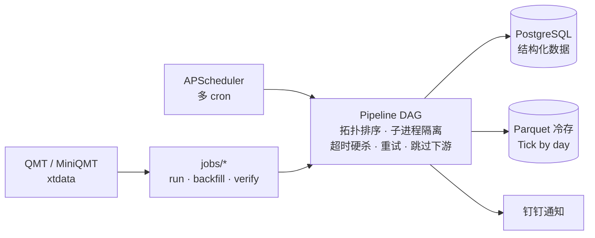

# data_collect — 自动化金融数据采集平台

> 一个**可调度、可扩展、可自愈**的金融数据采集底座。当前覆盖 A 股全维度数据（行情 / 财务 / Tick / 板块 / 指数），
> 以同一套 DAG 编排 + 定时调度框架，向爬虫、新闻公告、非结构化数据、向量数据库持续生长。


## 这是什么

`data_collect` 把"采什么、何时采、采到哪、怎么补"统一成一套框架：你用 YAML 声明任务与依赖，框架负责
**拓扑排序、定时触发、子进程隔离、超时重试、失败跳过、查漏补缺**；结构化数据落 PostgreSQL、海量 Tick 落
Parquet 冷存。目标是做一个**领域无关**的自动化数据中枢 —— 今天是 A 股行情，明天可以是新闻、研报、另类数据，
最终汇入向量库支撑语义检索与分析。

## ✨ 核心特性

- 🧩 **DAG 编排**：任务依赖写在 `config.yaml`，框架自动拓扑排序执行
- 🛡️ **生产级稳健**：每个任务独立子进程 + 超时硬杀 + 自动重试，失败跳过下游
- 🔁 **查漏补缺**：`verify` 模式按天幂等补缺，避免重复下载写入
- 🧊 **冷热分离**：结构化入 PostgreSQL，Tick 按日打包 Parquet+zstd 冷存（按股读取走谓词下推，不解压整文件）
- ⏰ **多 pipeline 多 cron**：每日主流水线 + 周末校验 + 月度财务，一次注册全部
- 🖥️ **跨平台**：Windows / Linux 双平台（xtquant 任务限 Windows，平台不匹配自动跳过）
- 📣 **可观测**：关键节点钉钉通知（含失败任务错误首行）
- 📚 **附带 QMT 知识库**：`.claude/skills/qmt-xtquant` 内置 xtdata/xttrader API 参考

## 🗂️ 数据覆盖

| 数据 | 周期 | 去向 |
|------|------|------|
| A股日线 / 分钟 K 线 | 每日 | PostgreSQL |
| Tick 分笔 | 每日 | Parquet（按日打包冷存）|
| 复权因子 | 每日 | PostgreSQL |
| ETF 日线 / 分钟 / 复权因子（不复权，裸6位码）| 每日 | PostgreSQL（分钟入既有分区表 `etf_minute`）|
| 财务数据（资产负债 / 利润 / 现金流 / 指标 / 股本 / 股东 等 8 表）| 每月 | PostgreSQL |
| 合约详情 / 板块分类 / 指数权重 | 每日 | PostgreSQL（快照 + 变更记录）|
| wave3 三浪选股 | 每日 | PostgreSQL |

## 🏗️ 架构



## 快速开始

```bash
# 1. 复制配置模板并填入实际值
cp config.example.yaml config.yaml

# 2. 安装依赖
pip install -r requirements.txt

# 3. 初始化数据库表
psql -h <host> -U <user> -d ashares -f sql/001_create_divid_factors.sql

# 4. 运行测试
pytest tests/ -v

# 5. 执行每日流水线
python run_job.py --mode pipeline --date 20260408
```

## 常用命令

```bash
# 按 DAG 执行每日流水线（分钟线 → 复权因子）
python run_job.py --mode pipeline [--date YYYYMMDD]

# 只执行单个任务
python run_job.py --mode pipeline --task divid_factors [--date YYYYMMDD]

# 补历史数据（分钟线/复权因子/Tick均支持）
python run_job.py --mode backfill --task divid_factors --start 20150101 --end 20260409
python run_job.py --mode backfill --task a_share_minute --start 20260101 --end 20260409
python run_job.py --mode backfill --task a_share_daily --start 20260101 --end 20260409
python run_job.py --mode backfill --task a_share_financial --start 20000101 --end 20260409
# 合约/板块/指数权重（快照数据，xtquant只返回当前状态，无法回溯历史）
# 首次run建立baseline，后续每日pipeline自动检测变更并记录changelog
python run_job.py --mode pipeline --task a_share_instrument
python run_job.py --mode pipeline --task a_share_sector
python run_job.py --mode pipeline --task a_share_index_weight
python run_job.py --mode backfill --task a_share_tick --start 20260101 --end 20260408

# 查漏补缺（检查日期范围内数据完整性，自动补缺）
python run_job.py --mode verify --task a_share_daily --start 20260401 --end 20260409
python run_job.py --mode verify --task a_share_minute --start 20260401 --end 20260409
python run_job.py --mode verify --task divid_factors --start 20260401 --end 20260409
python run_job.py --mode verify --task a_share_tick --start 20260401 --end 20260409

# wave3 选股（依赖 daily_kline 表）
python run_job.py --mode pipeline --task wave3 --date 20260409
python run_job.py --mode backfill --task wave3 --start 20260101 --end 20260409

# 数据缺失评估（对比应有股票和实际数据，输出缺失明细CSV）
python run_job.py --mode evaluate --task a_share_daily --start 20260301 --end 20260331
python run_job.py --mode evaluate --task a_share_minute --start 20260301 --end 20260331
python run_job.py --mode evaluate --task a_share_tick --start 20260301 --end 20260331

# 启动行情定时任务（缺省只注册行情管线；新闻管线由 run_news.py 独立调度）
python run_job.py --mode scheduler
# 只注册指定行情 pipeline（逗号可分隔多个）
python run_job.py --mode scheduler --pipeline weekly_tick_verify

# 启动新闻定时任务（独立入口，只认 news_* 管线/任务；Linux/systemd 用它）
python run_news.py
# 新闻补历史/查漏（口径与行情分离：run_job 传新闻任务会报错，反之亦然）
python run_news.py --mode backfill --task news_cctv --start 20260601 --end 20260701
python run_news.py --mode verify --task news_flash --start 20260701 --end 20260707

# 单次执行分钟线（兼容旧模式）
python run_job.py --mode once [--date YYYYMMDD] [--limit-stocks N]

# 清理 QMT 本地缓存 datadir（也由 monthly_qmt_clean 每月1号自动跑）
python tools/clean_qmt_cache.py --dry-run   # 先看会删多少、释放多少
python tools/clean_qmt_cache.py             # 实际清理
```

## Pipeline 编排

`config.yaml` 中可定义多个 pipeline，每个 pipeline 有独立 cron 调度。启动 scheduler 时一次注册全部。

### 当前 8 个 pipeline

| Pipeline | Cron | 任务 | 用途 |
|----------|------|------|------|
| `daily` | 每天 15:30 | a_share_daily → wave3, a_share_minute → divid_factors → instrument → sector → index_weight → tick | 主流水线 |
| `weekly_tick_verify` | 周六 08:00 | a_share_tick.run_verify(过去5个交易日) | tick 补漏 |
| `weekly_kline_verify` | 周日 08:00 | a_share_daily.run_verify + a_share_minute.run_verify(各过去10个交易日) | K线补漏 |
| `monthly_financial` | 每月最后一天 23:00 | a_share_financial | 财务月度更新 |
| `monthly_qmt_clean` | 每月1号 23:00 | clean_qmt_cache | 清理 QMT datadir 本地缓存，回收磁盘 |
| `news_flash` | 每 15 分钟 | news_flash（快讯双活采集） | 新闻快讯（成功静默） |
| `news_hourly` | 每小时 :37 | news_fulltext → news_announce_pdf → news_embed | 个股全文+公告PDF+补向量 |
| `news_daily` | 每天 20:40 | news_cctv → news_cctv_verify, news_flash_verify, news_announcement → news_announcement_verify → news_report | 联播采集+verify+日报 |
| `news_stock` | 每天 22:00 | news_stock → news_stock_verify | 全市场个股新闻采集+verify |

scheduler 启动时会以 ASCII 图打印每个 pipeline 的 DAG 编排（基于 phart+networkx）。新闻系
pipeline 不带 `platform`（不依赖 xtquant，Windows/Linux 均可运行），详见 [新闻资讯子系统](#-新闻资讯子系统)。

### 任务级配置字段

```yaml
- name: a_share_tick
  job: data_collect.jobs.a_share_tick   # 模块路径
  platform: windows                     # 仅在指定平台运行（不匹配自动跳过）
  depends_on: [a_share_index_weight]    # 上游依赖（失败则跳过下游）
  fn: run_verify                        # 调用 run_verify 而非 run（默认 run）
  days_back: 5                          # run_verify 时往前推几个交易日
  timeout: 2400                         # 子进程超时（秒），超时硬杀子进程
  retries: 1                            # 超时/失败时重试次数（每次新建子进程）
```

### 超时与重试

- 任务在 `ProcessPoolExecutor` 子进程中执行
- 超过 `timeout` 抛 `TimeoutError`，强杀 worker 释放 xtquant 资源
- `retries` 次重试期间发钉钉警告"第 N/M 次超时，准备重试..."
- 全部耗尽后失败，钉钉汇总通知附错误首行（`↳ 失败（2次后放弃）: ...`）

### a_share_tick 默认日期

`run()` 不传 `--date` 时**默认下载当天**（盘后采集当日 tick）。当天 tick 可能盘后稍晚才就绪；
若暂不可用，本任务**不写 `.empty` 标记**，交由 `weekly_tick_verify` 或下次运行补采，
避免把"尚未就绪"误标记为"无数据"而永久跳过。显式 `--date YYYYMMDD` 仍按指定日期执行。

## 项目结构

```
data_collect/              # 主包
├── config.py              # YAML配置加载
├── pipeline.py            # DAG任务编排（拓扑排序、平台过滤、失败跳过下游）
├── utils/                 # 公共工具
│   ├── db.py              # PostgreSQL操作
│   ├── notify.py          # 钉钉通知
│   ├── xtquant_utils.py   # xtquant公共工具（股票列表、批量下载等）
│   ├── date_utils.py      # 交易日工具
│   ├── df_utils.py        # DataFrame对齐
│   ├── export.py          # CSV导出
│   ├── indicators.py      # 通达信指标函数
│   ├── progress.py        # 双进度条
│   └── retry.py           # 重试策略
└── jobs/                  # 采集任务（每个实现 run() 接口）
    ├── a_share_minute.py  # A股分钟K线 → PostgreSQL
    ├── a_share_daily.py   # A股日线K线 → PostgreSQL
    ├── a_share_financial.py # A股财务数据(8张表) → PostgreSQL
    ├── a_share_index_weight.py # 指数成分权重（快照+变更记录）
    ├── a_share_instrument.py # 合约详情（快照+变更记录）
    ├── a_share_sector.py  # 板块/行业分类（快照+变更记录）
    ├── a_share_tick.py    # A股Tick → 按日打包 Parquet+zstd 冷存储（read_tick 读取）
    ├── divid_factors.py   # 复权因子 → PostgreSQL
    ├── wave3.py           # 3浪3选股 → wave3_stocks表 + 钉钉/邮件通知
    └── clean_qmt_cache.py # 清理 QMT datadir 本地缓存（月度，回收磁盘）

run_job.py                 # CLI入口
config.yaml                # 配置文件（不入git）
sql/                       # 建表SQL
tests/                     # pytest测试
tools/                     # 一次性脚本（如 tick 每股→按日打包迁移）
notebooks/                 # 读测试/探索 notebook
.claude/skills/            # qmt-xtquant：QMT/xtquant API 知识库（供 AI 编码参考）
```

## 数据库表

### `minutedata_tdx` — A股1分钟K线

| 字段 | 类型 | 说明 |
|------|------|------|
| 交易日期 | DATE | **PK** |
| 时间 | TIME | **PK** |
| 代码 | CHAR | **PK**，股票代码 |
| 开盘价 | DOUBLE | |
| 最高价 | DOUBLE | |
| 最低价 | DOUBLE | |
| 收盘价 | DOUBLE | |
| 成交量 | DOUBLE | |
| 成交额 | DOUBLE | |

### `divid_factors` — 除权除息因子

| 字段 | 类型 | 说明 |
|------|------|------|
| stock_code | VARCHAR(20) | **PK**，如 000001.SZ |
| date | DATE | **PK**，除权除息日 |
| interest | NUMERIC | 每股派息（税前） |
| stock_bonus | NUMERIC | 每股送股 |
| stock_gift | NUMERIC | 每股转增 |
| allot_num | NUMERIC | 每股配股数 |
| allot_price | NUMERIC | 配股价 |
| dr | NUMERIC | 除权因子（等比复权用） |
| created_at | TIMESTAMP | 创建时间 |

### `daily_kline` — A股日线K线

PK: `(stock_code, trade_date)`

| 字段 | 类型 | 说明 |
|------|------|------|
| stock_code | VARCHAR(20) | **PK**，如 000001.SZ |
| trade_date | DATE | **PK**，交易日期 |
| open | DOUBLE | 开盘价 |
| high | DOUBLE | 最高价 |
| low | DOUBLE | 最低价 |
| close | DOUBLE | 收盘价 |
| volume | DOUBLE | 成交量 |
| amount | DOUBLE | 成交额 |

### ETF 表 — `etf_minute` / `etf_daily_kline` / `etf_divid_factors` / `etf_nav` / `etf_info`

> 📖 完整说明见 **[ETF 子系统说明](docs/etf-subsystem-guide.md)**（采集内容 / 数据源 / 表结构 / 任务 / 调度 / 迁移 / 运维）。

ETF 与股票**物理隔离**：独立表、代码**裸 6 位**（如 `510300`，市场由号段推导 `159/16x→SZ`、`5xx→SH`）、K 线**不复权**、复权因子单独存（与股票 `divid_factors` 对称）。

- **`etf_minute`**（1min）：采纳既有 390M 行分区表（2014→今，按月分区，中文列 `日期/时间/代码/开盘/收盘/最高/最低/成交量/成交额/最新价`）。采集端按**列名**显式映射写入（列序为 O,C,H,L，与 `minutedata_tdx` 的 O,H,L,C 不同，故不能走位置对齐）。
- **`etf_daily_kline`**：`PK(code, trade_date)`，字段 `open/high/low/close/volume/amount`。
- **`etf_divid_factors`**：`PK(code, date)`，字段 `interest/stock_bonus/stock_gift/allot_num/allot_price/dr`。
- **`etf_nav`**（净值，跨平台/akshare）：`PK(code, trade_date)`，`close/iopv/discount_rate`（盘后 `fund_etf_spot_em` 快照）+ `unit_nav/accum_nav/daily_growth/nav_date`（逐只 `fund_etf_fund_info_em` 官方净值，backfill/verify）。
- **`etf_info`**+`etf_info_changelog`（基金信息快照，自动建表）：xtquant 合约详情（名称/上市日/份额）+ akshare（`基金类型`/`总市值`/`最新份额`）。
- ⏸ **`etf_pcf`（申赎清单）暂缓**：xtquant `get_etf_info` 需投研版客户端（当前返回 "function not realize"），免费源无稳定接口。

> ETF 净值/信息用 **akshare**（免费、免鉴权、跨平台）。`get_etf_codes` 依赖 MiniQMT 自维护的板块缓存，**不内联 `download_sector_data`**（无超时会阻塞）。

**落地顺序**（QMT/MiniQMT 需启动）：
1. 探针确认 ETF 板块名 → 回填 `config.yaml` 的 `etf.sectors`（脚本见 `scratchpad/probe_etf.py`）。
2. `config.yaml` 接线：`daily` pipeline 末尾加 `etf_daily→etf_minute→etf_divid_factors`，`weekly_kline_verify` 加 ETF verify。
3. 小样本验证：`etf_daily.run(date, limit_stocks=5)` / `etf_minute.run(date, limit_stocks=3)`，抽查列不错位。
4. 补数据：`etf_minute` 补 2025-07 缺口 + 2025-09→今；全量 backfill；`daily_kline` 分年段补全。

命令（QMT 需启动）：

```bash
# ETF 日线/分钟/复权因子补历史（可 --limit-stocks 小样本）
python run_job.py --mode backfill --task etf_daily          --start 20100101 --end 20260705
python run_job.py --mode backfill --task etf_minute         --start 20250701 --end 20250731   # 补 2025-07 缺口
python run_job.py --mode backfill --task etf_divid_factors  --start 20100101 --end 20260705

# daily_kline 历史补全（幂等补洞，分年段跑）
python run_job.py --mode backfill --task a_share_daily --start 20100101 --end 20141231
```

### `fin_balance` — 资产负债表（~160列）

PK: `(stock_code, report_date, announce_date)`。同一报告期可能有多次修订，按披露日区分。核心字段：

| 字段 | 说明 |
|------|------|
| stock_code / report_date / announce_date | **PK** 股票代码 / 报告期 / 披露日 |
| cash_equivalents | 货币资金 |
| tradable_fin_assets | 交易性金融资产 |
| bill_receivable / account_receivable | 应收票据 / 应收账款 |
| inventories | 存货 |
| total_current_assets | 流动资产合计 |
| fix_assets | 固定资产 |
| intang_assets / goodwill | 无形资产 / 商誉 |
| total_non_current_assets | 非流动资产合计 |
| **tot_assets** | **资产总计** |
| shortterm_loan / long_term_loans | 短期借款 / 长期借款 |
| accounts_payable / notes_payable | 应付账款 / 应付票据 |
| total_current_liability | 流动负债合计 |
| non_current_liabilities | 非流动负债合计 |
| **tot_liab** | **负债合计** |
| cap_stk / cap_rsrv / surplus_rsrv | 股本 / 资本公积 / 盈余公积 |
| undistributed_profit | 未分配利润 |
| **total_equity** | **股东权益合计** |

> 完整 160 列见 `sql/002_create_financial_tables.sql`

### `fin_income` — 利润表（~84列）

PK: `(stock_code, report_date, announce_date)`。核心字段：

| 字段 | 说明 |
|------|------|
| stock_code / report_date / announce_date | **PK** 股票代码 / 报告期 / 披露日 |
| **revenue** / revenue_inc | 营业总收入 / 营业收入 |
| total_expense / total_operating_cost | 营业总成本 / 营业成本 |
| sale_expense / less_gerl_admin_exp / financial_expense | 销售费用 / 管理费用 / 财务费用 |
| research_expenses | 研发费用 |
| plus_net_invest_inc | 投资净收益 |
| **oper_profit** | **营业利润** |
| plus_non_oper_rev / less_non_oper_exp | 营业外收入 / 营业外支出 |
| **tot_profit** | **利润总额** |
| inc_tax | 所得税费用 |
| **net_profit_incl_min_int_inc** | **净利润** |
| net_profit_excl_min_int_inc | 归母净利润 |
| s_fa_eps_basic / s_fa_eps_diluted | 基本EPS / 稀释EPS |

> 完整 84 列见 `sql/002_create_financial_tables.sql`

### `fin_cashflow` — 现金流量表（~116列）

PK: `(stock_code, report_date, announce_date)`。核心字段：

| 字段 | 说明 |
|------|------|
| stock_code / report_date / announce_date | **PK** 股票代码 / 报告期 / 披露日 |
| goods_sale_and_service_render_cash | 销售商品收到的现金 |
| stot_cash_inflows_oper_act | 经营活动现金流入小计 |
| stot_cash_outflows_oper_act | 经营活动现金流出小计 |
| **net_cash_flows_oper_act** | **经营活动现金流净额** |
| cash_recp_disp_withdrwl_invest | 收回投资收到的现金 |
| cash_pay_acq_const_fiolta | 购建固定资产等支付的现金 |
| **net_cash_flows_inv_act** | **投资活动现金流净额** |
| cash_recp_cap_contrib / cash_recp_borrow | 吸收投资 / 取得借款 |
| cash_pay_dist_dpcp_int_exp | 分配股利、偿付利息 |
| **net_cash_flows_fnc_act** | **筹资活动现金流净额** |
| **net_incr_cash_cash_equ** | **现金净增加额** |
| cash_cash_equ_end_period | 期末现金余额 |

> 完整 116 列见 `sql/002_create_financial_tables.sql`

### `fin_indicator` — 每股指标与财务比率（43列）

PK: `(stock_code, report_date, announce_date)`

| 字段 | 说明 |
|------|------|
| stock_code / report_date / announce_date | **PK** 股票代码 / 报告期 / 披露日 |
| s_fa_eps_basic / s_fa_eps_diluted | 基本每股收益 / 稀释每股收益 |
| s_fa_bps | 每股净资产 |
| s_fa_ocfps | 每股经营现金流 |
| s_fa_undistributedps | 每股未分配利润 |
| s_fa_surpluscapitalps | 每股资本公积 |
| du_return_on_equity / equity_roe / net_roe | 净资产收益率（多口径） |
| sales_gross_profit / gross_profit / net_profit | 销售毛利率 / 毛利 / 净利 |
| inc_revenue_rate / inc_net_profit_rate | 营收增长率 / 净利润增长率 |
| gear_ratio | 资产负债率 |
| inventory_turnover | 存货周转率 |
| actual_tax_rate | 实际税率 |
| sales_cash_flow | 销售现金比 |

### `fin_capital` — 股本变动（7列）

PK: `(stock_code, report_date)`

| 字段 | 说明 |
|------|------|
| stock_code / report_date / announce_date | 股票代码 / 报告期 / 披露日 |
| total_capital | 总股本 |
| circulating_capital | 已上市流通A股 |
| restrict_circulating_capital | 限售流通股份 |
| freeFloatCapital | 自由流通股本 |

### `fin_holdernum` — 股东户数统计（9列）

PK: `(stock_code, end_date)`

| 字段 | 说明 |
|------|------|
| stock_code / end_date / announce_date | 股票代码 / 截止日 / 披露日 |
| shareholder | 股东总数 |
| shareholderA | A股股东户数 |
| shareholderB | B股股东户数 |
| shareholderH | H股股东户数 |
| shareholderFloat | 已流通股东户数 |
| shareholderOther | 其他股东户数 |

### `fin_top10_holder` / `fin_top10_flow_holder` — 十大股东 / 十大流通股东（10列）

PK: `(stock_code, end_date, rank)`

| 字段 | 说明 |
|------|------|
| stock_code / end_date / announce_date | 股票代码 / 截止日 / 披露日 |
| rank | 排名（1-10） |
| name | 股东名称 |
| quantity | 持股数量 |
| ratio | 持股比例(%) |
| type | 股东类型（基金、QFII、一般法人等） |
| nature | 股份性质（国有股、流通A股等） |
| reason | 变动原因（新进、增持、未变等） |

### `instrument_info` — 合约详情快照

PK: `(stock_code)`。排除每日变动字段（涨跌停价、昨收等），只存静态信息，有变化时 UPSERT 更新。

| 字段 | 类型 | 说明 |
|------|------|------|
| stock_code | VARCHAR(20) | **PK** |
| ExchangeID | TEXT | 交易所（SZ/SH） |
| InstrumentName | TEXT | 证券名称 |
| OpenDate | TEXT | 上市日期（YYYYMMDD） |
| ExpireDate | TEXT | 退市日期 |
| FloatVolume / TotalVolume | DOUBLE | 流通股本 / 总股本 |
| PriceTick | DOUBLE | 最小变动价位 |
| VolumeMultiple | BIGINT | 合约乘数 |
| secuCategory / secuAttri | BIGINT | 证券类别 / 属性编码 |
| updated_at | TIMESTAMP | 最后更新时间 |
| *...其余 ~70 个字段* | | 期权/转债/期货专用字段（A股多为默认值） |

> 完整 83 字段自动建表，排除每日变动字段：PreClose, UpStopPrice, DownStopPrice, SettlementPrice, TradingDay, IsTrading, InstrumentStatus, LastVolume

### `instrument_changelog` — 合约变更记录

PK: `(stock_code, changed_at, field_name)`

| 字段 | 类型 | 说明 |
|------|------|------|
| stock_code | VARCHAR(20) | **PK** |
| changed_at | DATE | **PK**，变更日期 |
| field_name | VARCHAR(80) | **PK**，变更字段名 |
| old_value | TEXT | 旧值 |
| new_value | TEXT | 新值 |

### `sector_stock` — 板块/行业分类成分

PK: `(sector_name, stock_code)`。采集 GICS 行业(4级)、同花顺行业(3级)、概念、风格，共 ~1500 个板块。

| 字段 | 类型 | 说明 |
|------|------|------|
| sector_name | TEXT | **PK**，板块名称（如 `GICS1信息技术`、`THY2半导体`、`TGN人工智能`） |
| stock_code | VARCHAR(20) | **PK**，成分股代码 |
| update_date | DATE | 最后更新日期 |

### `sector_changelog` — 板块成分变更记录

PK: `(sector_name, stock_code, changed_at, action)`

| 字段 | 类型 | 说明 |
|------|------|------|
| sector_name | TEXT | **PK** |
| stock_code | VARCHAR(20) | **PK** |
| changed_at | DATE | **PK**，变更日期 |
| action | VARCHAR(10) | **PK**，`add`（调入）或 `remove`（调出） |

### `index_weight` — 指数成分权重

PK: `(index_code, stock_code)`。采集沪深300、中证500、中证1000、上证50、创业板指。

| 字段 | 类型 | 说明 |
|------|------|------|
| index_code | VARCHAR(20) | **PK**，如 000300.SH |
| stock_code | VARCHAR(20) | **PK**，成分股代码 |
| weight | DOUBLE | 权重(%) |
| update_date | DATE | 最后更新日期 |

### `index_weight_changelog` — 指数权重变更记录

PK: `(index_code, stock_code, changed_at)`

| 字段 | 类型 | 说明 |
|------|------|------|
| index_code | VARCHAR(20) | **PK** |
| stock_code | VARCHAR(20) | **PK** |
| changed_at | DATE | **PK**，变更日期 |
| old_weight | DOUBLE | 旧权重（调出时有值，调入时为 NULL） |
| new_weight | DOUBLE | 新权重（调出时为 NULL，调入时有值） |

### Tick 冷数据（Parquet 文件，不入库）

**按交易日打包**：每个交易日全部股票存为**单个** Parquet 文件（含 `stock_code` 列）。相比每股一文件，体积更省（~20%+）、文件数从每日数千降为 1，利于 NAS 备份/同步。

- 存储路径：`Z:\A股冷数据\tick_by_day\{年}\{月}\{日}.parquet`（Parquet+zstd；路径由 `config.yaml` 的 `tick_storage.base_dir` 决定）
- 写入：分批下载 → 按 row-group 增量写入当日文件（内存可控）→ `.tmp` 原子重命名落盘
- 幂等：当日文件已存在即跳过；某交易日确无数据写 `{日}.empty` 标记，避免 verify 反复重试（删 `.empty` 可强制重试）
- 读取：`read_tick(trade_date, stock_code=None)` —— 传 `stock_code` 走谓词下推，只返回该股的行、不解压整文件（数据按代码有序写入、row-group 区间不重叠，可精准跳过）。读测试见 `notebooks/tick_read_test.ipynb`
- 旧版"每股一文件"迁移：`python tools/migrate_tick_to_packed.py [--dry-run] [--delete-old]`

> ⚠ QMT 对 tick(分笔) 仅保留约近 3~4 周，过期日期 `download` 静默返回空、无法补下，故须及时采集。

字段（每行一个 tick）：

| 字段 | 说明 |
|------|------|
| stock_code / datetime | 股票代码 / 时间（北京时间，UTC毫秒+8h） |
| last_price / open / high / low / last_close | 最新价 / 开 / 高 / 低 / 昨收 |
| volume / amount | 成交量 / 成交额 |
| ask_price_1..5 / bid_price_1..5 | 五档卖价 / 五档买价 |
| ask_vol_1..5 / bid_vol_1..5 | 五档卖量 / 五档买量 |
| transaction_num | 成交笔数 |
| open_int / pe | 持仓量 / 市盈率 |

### `wave3_stocks` — 3浪3选股结果

PK: `(trade_date, stock_code)`

| 字段 | 类型 | 说明 |
|------|------|------|
| trade_date | DATE | **PK**，交易日期 |
| stock_code | VARCHAR(20) | **PK**，股票代码 |
| open / high / low / close | DOUBLE | 开/高/低/收 |
| volume / amount | DOUBLE | 成交量 / 成交额 |
| wr1_10 / wr2_20 | DOUBLE | WR 威廉指标(10日/20日) |
| k / d / j | DOUBLE | KDJ 指标 |
| rsi9 | DOUBLE | RSI(9日) |
| market_cap | DOUBLE | 总市值（亿元） |
| list_days | INTEGER | 已上市天数（自然天） |

选股条件：K>80 且 WR1<20 且 WR2<20 且 RSI9>70 且非ST 且当天有交易。
market_cap 和 list_days 仅存储不参与筛选，供 web 端自行组合过滤。

#### wave3 算法版本对比

| | v1（旧） | v2（当前） |
|---|---------|-----------|
| 价格数据 | 不复权 | **等比前复权**（divid_factors.dr 累乘） |
| K值条件 | 连续3天 K>80 | 仅当天 K>80 |
| 基本面过滤 | 无 | 排除 ST/退市、停牌（volume=0） |
| 附加字段 | 无 | market_cap（亿元）、list_days（天） |
| 上市日期来源 | instrument_info.OpenDate（751只缺失） | "股票全部信息汇总".上市日期（零缺失） |
| 总股本来源（每日） | instrument_info.TotalVolume | "股票全部信息汇总".总股本（万股） |
| 总股本来源（backfill） | 无（NULL） | fin_capital.total_capital（股），fallback 汇总表 |
| 市值计算价格 | — | 不复权 close（真实交易价格） |
| DB存储价格 | 不复权 | 不复权（指标基于前复权计算，价格存不复权） |

## 进程模型

主进程只负责调度，每个任务在独立子进程中执行（`ProcessPoolExecutor`），完成后进程退出、内存自动释放。
避免 Python GC 不完善导致长时间运行后内存泄漏。

## 新增采集任务

1. 在 `data_collect/jobs/` 下创建模块，实现 `run(run_date, **kwargs) -> str`（可选 `run_backfill()`）
2. 在 `config.yaml` 的 `pipelines.daily.tasks` 中添加任务配置（可选 `depends_on`、`platform`）
3. 如需建表，在 `sql/` 下添加 SQL 文件

## 📰 新闻资讯子系统

以 **OpenSearch 为存储与检索核心**的 A 股新闻采集-存储-检索子系统：全文（BM25）+ 向量（kNN）
混合检索为一等能力，持续积累财经快讯与新闻联播文字稿，支撑 AI 智能体做数据分析与研报生成。
分层架构：**数据源（AkShare 等社区出口）→ 采集 job → 原始归档层（NAS）→ OpenSearch（物理索引按年
`news-{year}` + 别名 `news`）→ `search_news()` 消费入口**。

> **完整子系统说明**（采集内容/数据源/数据组织/数据库设计/清洗打标/任务详情/调度/检索/健壮性）见
> [docs/news-subsystem-guide.md](docs/news-subsystem-guide.md)；架构设计见
> [docs/superpowers/specs/2026-07-02-news-opensearch-plan.md](docs/superpowers/specs/2026-07-02-news-opensearch-plan.md)。

### 采集 job 与日报

| Job | 说明 |
|-----|------|
| `news_cctv` | 新闻联播文字稿（AkShare `news_cctv`，历史下限 2016-02-03）。run 采当天、backfill 补历史、自然日 verify 补漏，T+2 仍空写空日标记（`channel=marker`）终止重试 |
| `news_flash` | A股财经快讯**双活**采集（财联社 `stock_info_global_cls` + 东财 `stock_info_global_em`）。源级失败隔离（双活全挂才算失败）、"整窗全新"溢出检测告警、窗口重放 verify |
| `news_announcement` | 公司公告（巨潮官方 API `hisAnnouncement/query`，`utils/cninfo.py`）。**单查询全市场**深沪京并集元数据、按 `totalpages` 分页、requests→curl_cffi 限频兜底、自然日 verify；`channel=announcement`，Phase 1 元数据（Phase 2 抽 PDF 正文写 `body`） |
| `news_stock` | 个股新闻：全市场逐票 `stock_news_em`（每票 10 条摘要），**内存聚合 article→stocks[]**（跨票重复 17%）、`channel=stock`、`_id=sha1(url)`、摘要向量走 news_embed；滚动窗归档重放 verify；失败码整轮后重试一次、失败率>5% 告警 |
| `news_fulltext` | 个股新闻全文抽取（Phase 2）：并发(6)抓 `新闻链接`（requests→curl_cffi）→ trafilatura 抽正文，经共享核心 `bodyfill` 写 `body`+`vec_status=pending`（触发全文重编码）、失败 `body_status=failed`（摘要兜底不重试） |
| `news_announce_pdf` | 公告 PDF 正文抽取（⑤ Phase 2）：并发(4)下载 PDF（≤20MB/`%PDF` 魔数）→ PyMuPDF 抽文本层，经 `bodyfill` 写 `body`（截断 5 万字）+`pdf_status=done`；扫描版/失败 `failed`（title 兜底不 OCR） |
| `news_embed` | 小时级补向量：扫 `vec_status=pending` 取显式 `_id` 快照 → 批量 encode（bge-m3）→ 按 `_id` 写回置 `done`。BM25 入库即可搜、向量 ≤1h 补齐；pending 积压告警 |
| `news_report` | 钉钉日报：当日各 channel 入库数（flash/cctv/marker + 其他）+ pending 补向量积压（总数 + 最老滞留分钟）。索引未建仍发、发送失败不反噬 job |

### 调度（四条 pipeline）

| Pipeline | Cron | 任务 | 通知 |
|----------|------|------|------|
| `news_flash` | 每 15 分钟 | news_flash | `on_failure`（成功静默，避免刷屏） |
| `news_hourly` | 每小时 :37 | news_fulltext → news_announce_pdf → news_embed | `on_failure` |
| `news_daily` | 每天 20:40 | news_cctv → news_cctv_verify, news_flash_verify, news_announcement → news_announcement_verify → news_report | 保留成功汇总 |
| `news_stock` | 每天 22:00 | news_stock → news_stock_verify | 全市场个股新闻采集+verify |

### 检索用法 `search_news()`

```python
from data_collect.utils.news_search import search_news

# mode: hybrid（默认，需预建 search pipeline）/ rrf（客户端融合，无 pipeline 依赖）/ bm25 / knn
res = search_news(
    "光伏 组件 涨价",
    top_k=10,
    channel=["flash", "cctv"],          # str 或 list，默认排除 channel=marker
    date_range=("20260601", "20260630"),  # (start, end)，端点 YYYYMMDD / YYYY-MM-DD，单边可 None
    stocks=["600519.SH"],               # terms 过滤
    mode="hybrid",
)
# → {"total": N,
#    "hits": [{title, source, channel, pub_time, url, score, highlight}, ...]}
#    total 供判断召回充分性；highlight 为 title+content 片段列表（无则 None）
```

- 四种 mode：`hybrid`（BM25+kNN 归一融合，OpenSearch 原生）、`rrf`（客户端两路 RRF 融合，质量基线/pipeline 未建时替代）、`bm25`（单路，**绝不加载 embedding 模型**，模型不可用时的降级路径）、`knn`（纯向量）。
- 过滤器注入子查询内部（`bool.filter` / `knn.filter`），不用 `post_filter`（会丢 kNN 窗口内相关结果）。
- 冷启动容错：别名/索引尚未建（404）按空结果返回，不炸消费方。

### 原始归档层

`Z:\A股冷数据\news\raw\{source}\YYYY\MM\DD.jsonl.gz`（每行一条含 `raw_*` 原文的信封，追加不改写）。
NAS 不可用时同格式降级落本地 **spool 目录** + 钉钉告警，**入库照常**；每轮 job 开头尝试把 spool
搬回 NAS（按 `_id` 幂等）。快讯窗口不可回补，归档层是其唯一存档，绝不让归档单点阻塞采集。

### 建置清单（管理员一次性动作）

运行时账号 `news_writer` 仅 `news*` 索引级 CRUD，**以下集群级/建置动作需管理员执行一次**（见 spec §5.6）：

1. **分词插件**：当前无插件时索引自动降级 `standard` analyzer；装 `analysis-smartcn`（或社区 IK）后走
   §5.4 reindex runbook 升级到中文分词（新建 `news-{year}-v2` → 归档 replay → 别名原子切换）。
2. **hybrid search pipeline**（hybrid 模式必需）：`PUT /_search/pipeline/news-hybrid`，body 见
   `data_collect/utils/news_search.py::ensure_hybrid_pipeline` docstring（`normalization-processor`
   min_max + arithmetic_mean），或直接以管理员账号调该函数一次。未建置时用 `mode="rrf"` 替代。
3. **集群设置** `action.auto_create_index: "-news*,+*"`：禁止自动创建 `news*` 索引，防误写触发动态建出
   无 knn 设置/无中文分词/不挂别名的坏索引。
4. **周 snapshot 仓库注册**（`path.repo` fs 仓库）：快速恢复通道，归档全量重放是终极兜底。
5. **删除测试残留索引** `news-2099`（单测/演练可能留下的哑索引）。

> **服务器部署**：OpenSearch + Dashboards 3.7.0 从零部署的完整手册（含磁盘/账号/建置/防火墙 + 配置汇总）见
> [`docs/deploy/opensearch-3.7-server-setup.md`](docs/deploy/opensearch-3.7-server-setup.md)；软件侧一键部署脚本（幂等、密码走环境变量、不碰磁盘）
> [`docs/deploy/deploy_opensearch.sh`](docs/deploy/deploy_opensearch.sh)。

## tick 微观结构分析技能 (tick-microstructure)

位于 `.claude/skills/tick-microstructure/`，是一个**零外部依赖**的 L1 快照 tick 微观结构分析库，
可独立于本项目的数据层使用。覆盖五大维度：资金流向（Lee-Ready / BVC）、盘口压力（OBI / 微价格 / 委比）、
流动性（有效价差 / Amihud / Roll / Kyle-λ）、竞价行为（开盘集合竞价分析）、执行质量（VWAP / TWAP / 滑点）。

**30秒上手：**
```python
import sys; sys.path.insert(0, ".claude/skills/tick-microstructure")
import tick_analysis as ta

# 方式一：直接读本项目打包的 Parquet（推荐）
result = ta.analyze(ta.from_packed_parquet(r"Z:\A股冷数据\tick_by_day\2026\06\26.parquet", "002602.SZ"))

# 方式二：外部项目自备 DataFrame（列名对齐即可）
result = ta.analyze(ta.from_dataframe(df, {}))

print(result["money_flow"])   # buy / sell / net / net_ratio（元）
print(result["vwap"])         # 全天成交量加权均价
```

**L1 边界说明**：所有指标均为统计近似，无法识别逐笔成交（深交所 Level-2 才有）、真实大单来源或席位信息。
详见 [SKILL.md](.claude/skills/tick-microstructure/SKILL.md)。

## 🗺️ 路线图

- ✅ A 股 QMT 采集：日线 / 分钟 / Tick / 财务 / 复权 / 合约 / 板块 / 指数权重
- ✅ DAG 编排 + 定时调度 + 查漏补缺 + Tick 按日打包冷存
- ✅ 内置 QMT/xtquant API 知识库（AI 编码辅助）
- ✅ 新闻资讯子系统 MVP：快讯/联播采集 + OpenSearch 混合检索（BM25+kNN）+ 原始归档层
- 🚧 数据质量监控与告警完善
- 🚧 新闻扩源：政策/官媒（RSSHub）、公告全文、个股新闻、IK 分词 + reindex 升级
- 🔮 通用爬虫框架（声明式配置数据源）
- 🔮 非结构化数据处理流水线
- 🔮 **向量数据库 + RAG**：新闻检索封装为 MCP server，多源数据汇入向量库支撑语义检索与研报生成

## 🤝 贡献

欢迎 issue / PR。新增采集任务见上方「新增采集任务」；提交前请 `pytest tests/ -v` 确保测试通过。

## 📄 License

[MIT](LICENSE) © 杨鸣
